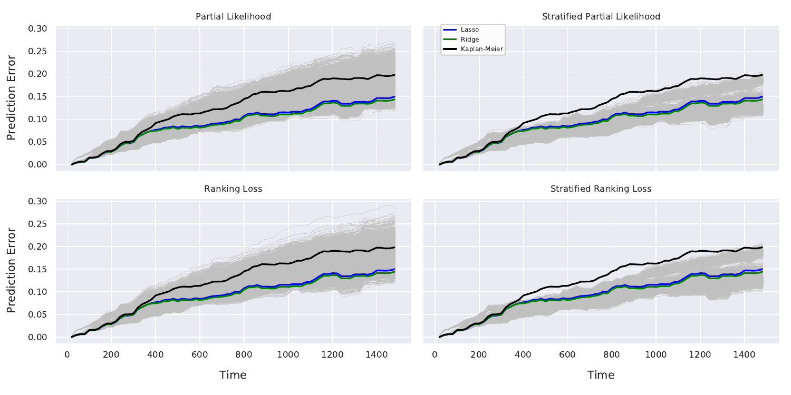
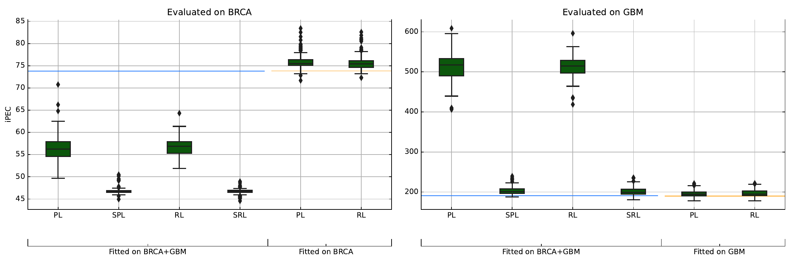

# Stratified Neural Networks in a time-to-event setting

This repository contains all code for reproducing the results of the presented methods in the manuscript "Stratified neural networks in a time-to-event setting". 

Specifically you find here:

1. an implementation of [stratified loss functions](src/modules/torch_models.py) for training deep neural network on time to event (survival) data

2. Python scripts for reproducing the analyses shown in the manuscript ([training of networks](src/train_models.py) and subsequent [evaluation](src/evaluate_models.py) as well as the [transfer learning training](src/train_models_transfer.py) approach together with corresponding [transfer learning evaluation](src/evaluate_models_transfer.py).

3. An exemplary [Jupyter Notebook](notebook.ipynb) which, based on a small data example, demonstrates how the proposed methods can be applied.


All scripts written in Python and build on [PyTorch](https://pytorch.org) for training the deep networks, [scikit-learn](https://scikit-learn.org/stable/) and [scikit-survival](https://github.com/sebp/scikit-survival). 

For all our experiments we used Python Version 3.8.3

For reproducing the results, execute the steps described below.

Create a virtual environment
```
python3 -m venv .venv
```

Activate the virtual environment
```
source .venv/bin/activate
```

Install dependencies (environment needs to be activated)
```
pip install -r requirements.txt
```

Navigate to the folder with the source code
```
cd src
```

In order to train the models you just need to start the corresponding script and parse the tumor type combination you want to analyse as command line arguments. To reproduce the results from the manuscript this would be: 
```
python3 train_models.py BRCA GBM LGG KIRC KICH KIRP
```

For other tumor type combinations you would type for example `python3 train_models.py GBM LGG`. This will automatically download and create the datasets needed for the tumor type combination, and start fitting afterwards. You can play around with the hyperparameters provided
in the [config file](src/optimization_configs.json). If *SAVE=True* is selected, the summary statistics needed for later evaluation are automatically saved into files.

In order to evaluate the fitted models, you need to parse the tumor type combination as command line arguments to the evaluation script:
```
python3 evaluate_models.py BRCA GBM LGG KIRC KICH KIRP
```

Which will generate all plots, including the prediction error curves for all models:



Same procedure can be applied for the transfer learning results. Start with:

```
python3 train_models_transfer.py GBM KIRC
```

And for the subsequent evaluation execute:
```
python3 evaluate_models_transfer.py GBM KIRC
```

Which will generate the plots for comparing stratified vs. not stratified fitted data on augmented data:


{}
